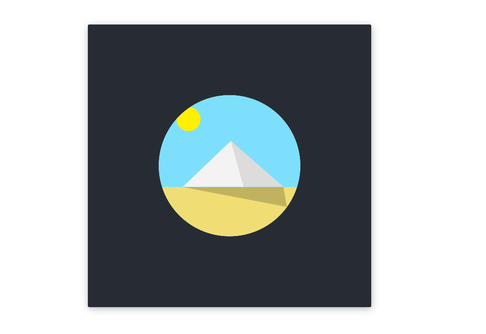

# Day 3 of the 100 Days CSS Challenge
The Pyramide: Not as challenging as the real pyramids in Egypt, but the shadow path is not easy.

This is a simple HTML and CSS project that creates a rotating sun and sand animation. The project is split into two files: `index.html` and `style.css`.
